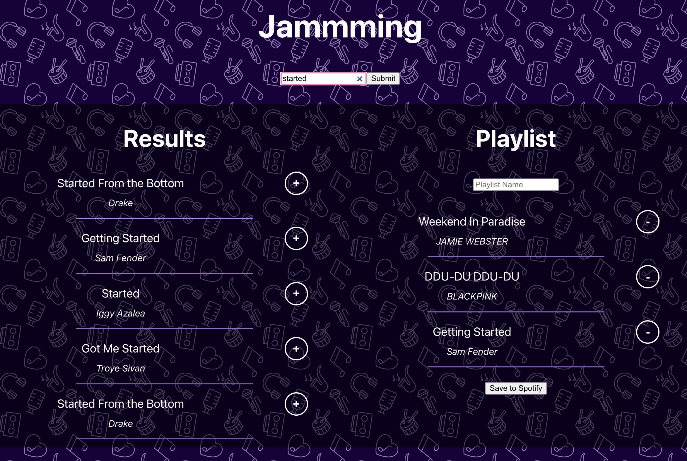

# Jamming

This is an app for creating playlists on Spotify.
Users can:

-   Search for songs.
-   Add songs to a tracklist.
-   Create a playlist from their tracklist, with a playlist name of their choice.

This app uses the Spotify Web API through the [Implicit Grant Flow](https://developer.spotify.com/documentation/web-api/tutorials/implicit-flow).

This app was created as a Portfolio project by Codecademy.

## Available Scripts

From the project directory, you can run:

### `npm start`

Runs the app in the development mode.\
Open [http://localhost:3000](http://localhost:3000) to view it in your browser.

## Design

